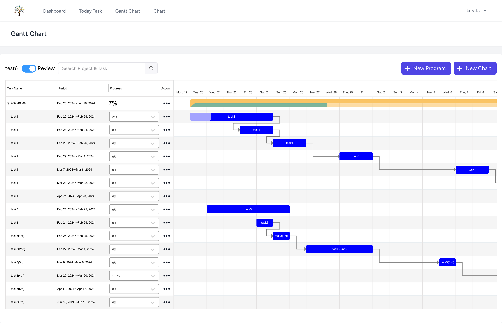
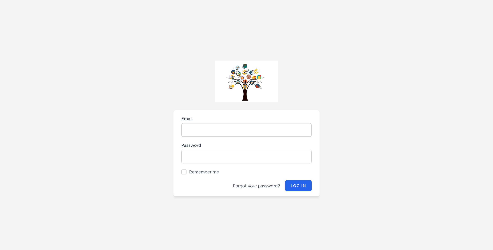
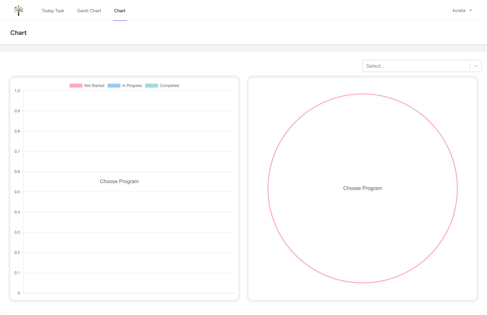
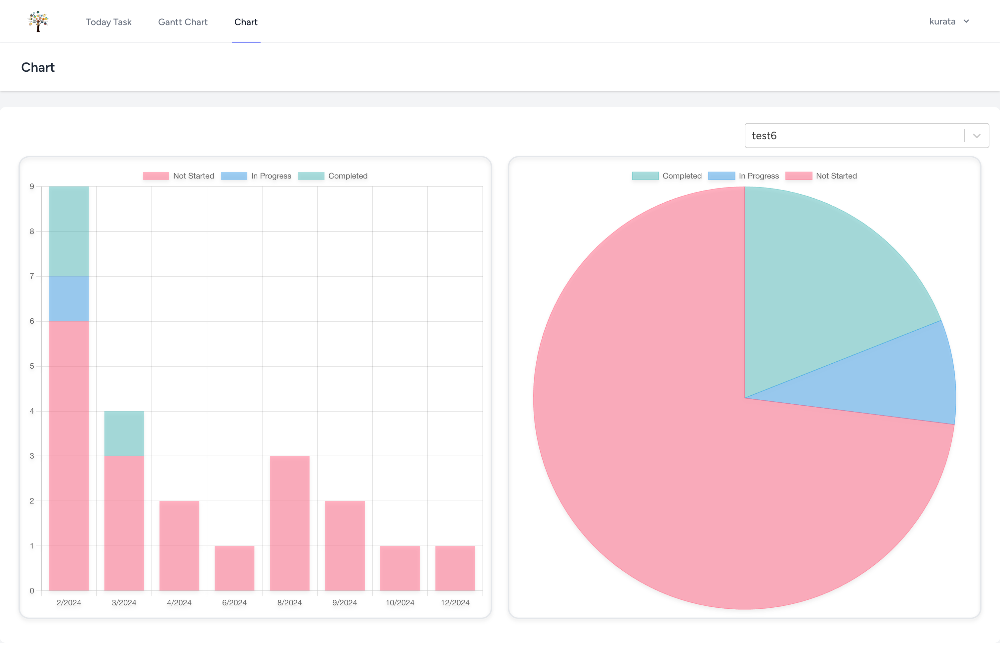
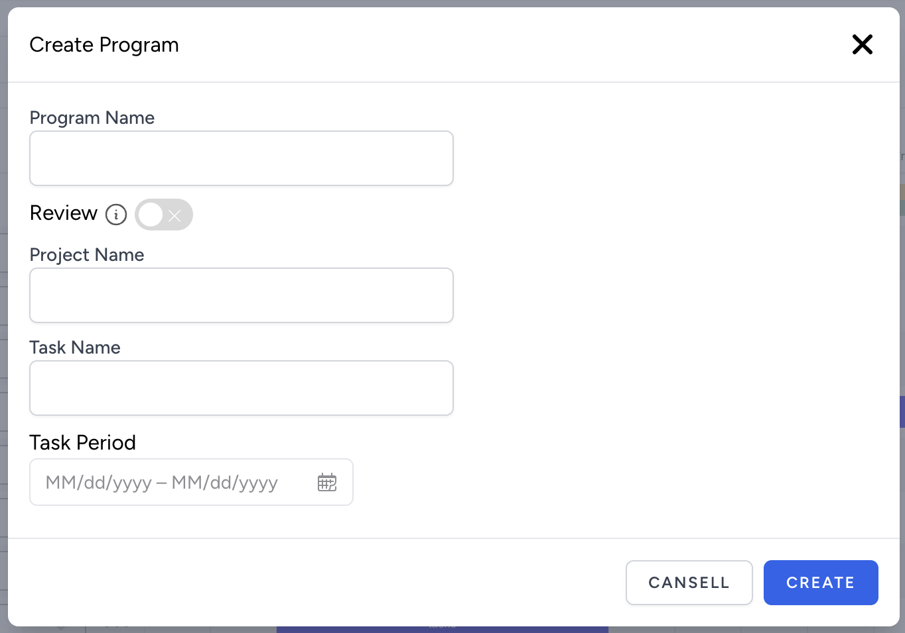
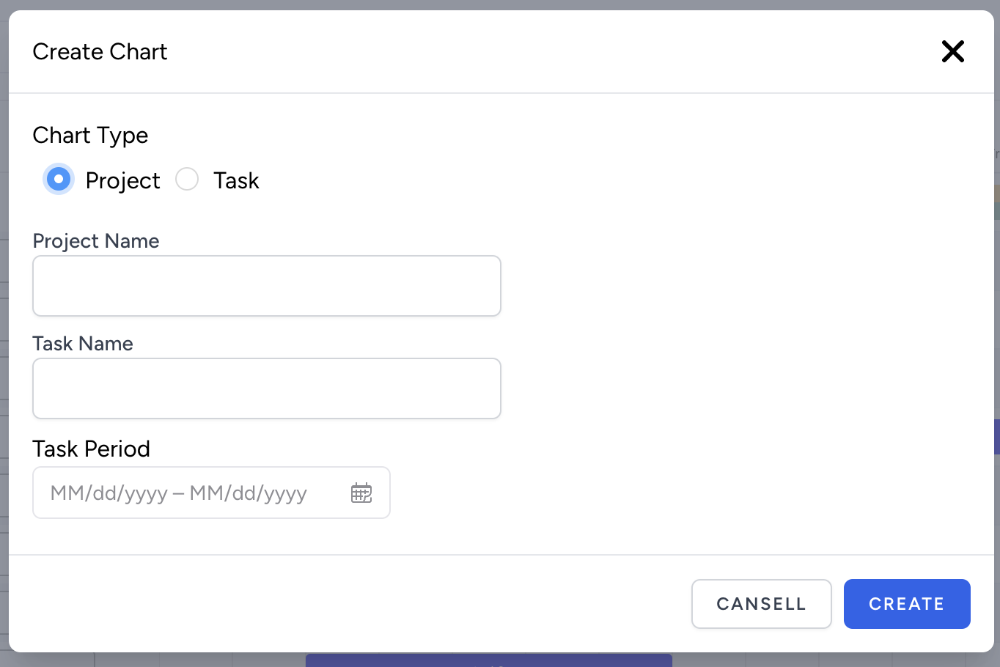
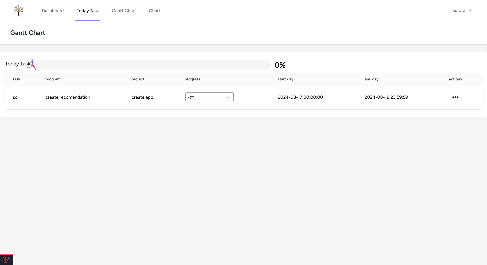
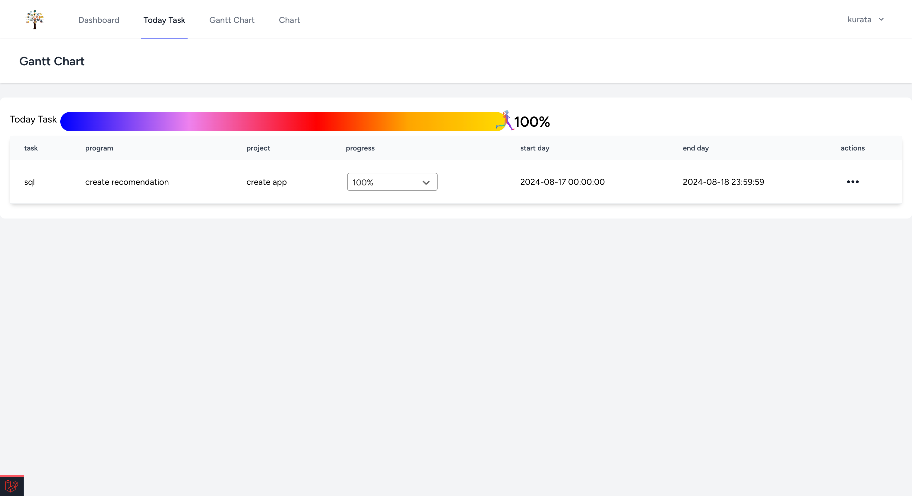
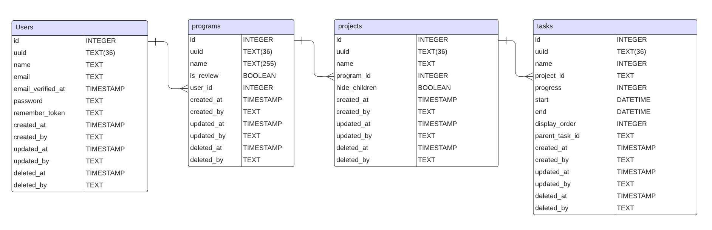

 

# Application Image

 

 

## Overview
Study-Focused Task Management Tool
Efficient Learning Enabled by Scientifically Timed Review

# Function Image
| Login |　Gantt Chart |
| ---- | ---- |
|  |  |

| Un Selected |　Draw Chart |
| ---- | ---- |
|  |  |

| Create Program | Create Chart |
| ---- | ---- |
|  |  |

| Today Tasks | Today Tasks2 |
| ---- | ---- |
|  |  |

 

## Technology used

| Category          | Technology Stack                                      |
| ----------------- | --------------------------------------------------    |
| Front-End         | HTML, CSS, Tailwindcss 3.2.1, JavaScript, React 18.2.0|
| Back-End          | PHP 8.1, laravel 10.10                                |
| Database          | MySQL 8.0.35                                          |
| Web Server        | Nginx                                                 |
| Environment setup | Docker                                                |
| CI/CD             | GitHub                                                |

## Feature List
- Project List & CURD
- Task CURD
- Gantt Chart
- Progress Rate

## ER diagram
